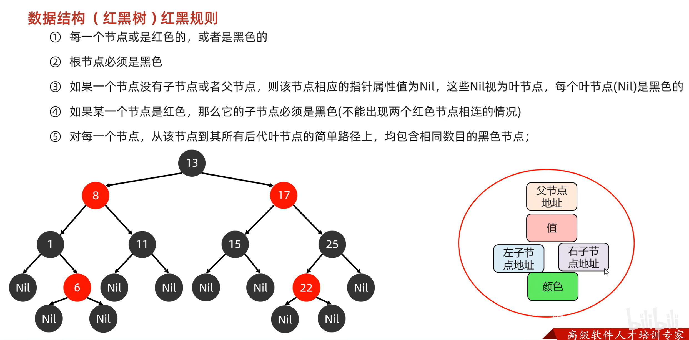
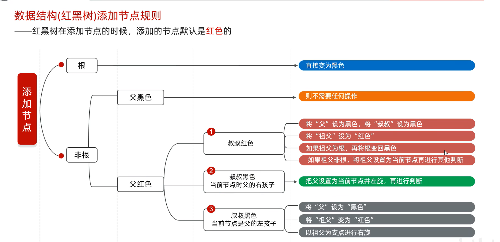
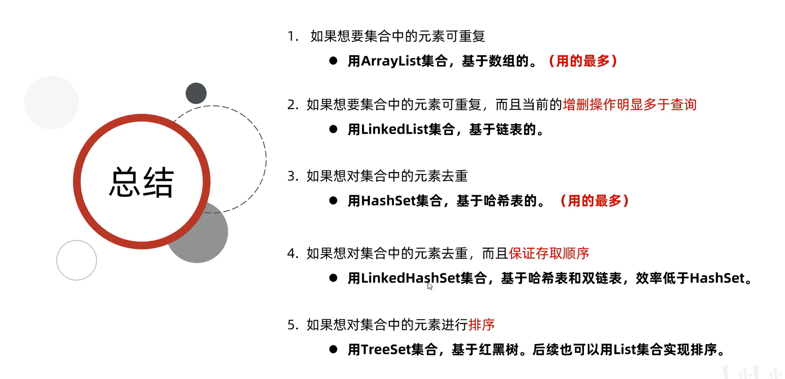

# java-learn
git小贴士：连接的时候要取消http和https的代理：
//取消http代理
git config --global --unset http.proxy
//取消https代理
git config --global --unset https.proxy

记录java学习
tip:
1.数据的存储和计算都是以补码的形式进行的。

2.在java中，位移操作是针对int和long的，在位移和计算时，char、byte、short的数据都会被自动转换成int类型来操作。

3.只使用两个变量的情况下调换它们的值:{
 a=a+b;
 b=a-b;
 a=a-b;
}

4.条件判断语句更安全的写法:字面量 == 变量；->这样在将"=="写成"="时程序会直接报错，提高程序的安全性。

5.Java中方法是平级关系，不能嵌套定义方法。main方法一般放在最上边，其他方法定义在main方法的下面，并且不需要提前声明（同一个类中）

6.一个标准的JavaBean：

    1.类名见名知意，大驼峰命名法。
    2.使用private修饰成员变量。
    3.至少提供两个构造方法：空参构造和带全部参数的构造方法。
    4.为每一个成员变量提供set和get方法。
    5.如果有其他行为，也要在类中定义。
    
7.Java中键盘录入有两套体系：
    ·第一套：nextInt,nextDouble,next:不接收制表符，空格，回车。遇到制表符，空格，回车就不会接收后面的内容,并且会将其顺延往下。
    ·第一套体系中接收上一个键盘录入的顺延内容时会自动舍弃开头的空格，制表符和回车。（注：只舍弃开头的）
        
    ·第二套：nextLine:可以接收空格，制表符和回车。并且遇到回车才停止接收数据。
    ·由于nextLine接收顺延数据时不会自动舍弃空格，制表符和回车，所以两套混用会导致回车传递而少一次键盘录入。
        
8.创建字符串：
    ·直接赋值创建的字符串对象存储在字符串常量池(StringTable)中，可以复用。每次复用时引用的地址值相同。
    ·使用new创建出来的字符串无法复用。每次new时都会在堆上开辟新空间用于存储此时的字符串。
        
9.String，StringBuilder，StringJoiner：

    ·String:基础操作包括：substring，replace，charAt，equals，toCharArray等，以及字符串不同创建方式导致存储位置的不同。
                    注意事项：键盘录入的字符串属于 new 出来的。
    
    ·StringBuilder:基础操作包括：append，reverse，toString等。
                    应用场景：1.字符串的拼接(不会出现中间量，节省空间和时间)。
                             2.字符串的反转。
                            
    ·StringJoiner:基础操作包括：add，toString等。
                    注意事项：1.构造方法必须带参，一种是只规定间隔，另一种是规定开头，间隔和结尾。
                             2.JDK8提出来的新特性，之前的版本无法使用StringJoiner。
                    应用场景：使用特定场景拼接字符串。

10.String拼接的底层原理：

    ·String s = "a"+"b": 没有变量的拼接：javac在编译java文件时直接生成"ab"字符串，该字符串属于串池，可以复用。
    ·String s1 = s2 + s3: 有变量参与的拼接
                    JDK8之前：先生成一个StringBuilder对象，使用sb.append()，然后使用toString()生成字符串对象。每一个"+"都会导致生成两个对象： StringBuilder 和 String。
                    JDK8之后：系统底层估计本次拼接得到的字符串大小，生成数组，将字符串放入数组中，最后再生成最终的字符串。

11.StringBuilder底层原理：
    ·默认创建大小为16的字节数组
    ·根据添加的内容长度(len)进行扩容：
            len<=16,直接存；
            16<len<=34,扩容到16*2+2=34字节；
            len>34：直接扩容到len字节。

12.static

    ·静态变量属于类，该类的全体对象共享。
    ·静态变量(方法)随着类的加载而加载，优先于对象。
    
    ·静态方法多用于工具类和测试类。
    ·静态方法无法直接调用非静态的变量和方法(没有this关键字)，但是可以在静态方法中构造对象调用。
     public class Teacher(){
         public static void show(){
             Teacher t = new Teacher();
             t.其他方法;
             
             Student s = new Student();
             s.其他方法;
             
         }
     
     }

13.extends
	
	终极父类：Object
	子类与父类的继承关系：
				private		非private
	构造方法	无法继承    无法继承	继承会违背构造方法与类名相同的规则。
	成员变量	可以继承	可以继承	私有的成员变量无法直接调用，但仍然会被子类继承。
	成员方法    无法继承    可以继承	实际上是添加到虚方法表中的方法才能被子类继承。
	
	虚方法表：非private，非final，非static修饰的方法可以添加入虚方法表中，表中的方法可以被继承。
	
	创建子类实例时，会使用一部分内存存储从父类继承下来的成员变量。
	成员变量(成员方法同理)：当子类没有重新定义该变量时，this和super都是指向父类的该变量；当子类重新定义后，this和super指向的变量地址才有区别。
	
	方法的重写(@Override)：本质是覆盖从父类继承的虚方法表中的同名方法。
						 1.只有添加到虚方法表中的方法才能被重写。
						 2.重写的方法尽量与父类保持一致。
						 3.重写方法时子类的访问权限要大于等于父类。
						 4.重写方法时子类的返回值类型要小于等于父类。
						 
	构造方法:子类的构造方法会在第一行默认加上一个父类的空参构造super()，并且super()前不许有其他语句。
	this()(前不许有其他语句):调用子类的其他构造方法，此时该构造方法就不会加上super(),因为调用的其他构造方法会自带super()。
	
	标准的JavaBean：和之前的相同，空参构造、全参构造（包括父类的变量），子类的变量提供set和get方法，需要重写的方法以及子类的特殊方法。
	
14.多态
	
	Animal a = new Dog():调用a.成员变量和a.成员方法
				编译      运行
	成员变量：	Animal   Animal      检查Animal类中有无该变量，实际运行也是输出Animal中的该变量。
	成员方法	Animal   Dog 		 检查Animal类中有无该方法，但由于子类重写覆盖了虚方法表，实际运行的时候是Dog中的重写方法。
	
	优势与弊端：父类类型参数可以接收所有子类对象；但无法调用子类的特有功能(编译看左边)。
	解决方法：强制类型转换：Dog d = (Dog)a;将a转成真正的Dog,这样就可以调用Dog的特有方法了。
	强转的问题：强转类型与实际类型不一致就会报错。
		  解决：使用instanceof: a instanceof Dog;结果返回boolean
		  JDK14新特性：a instanceof Dog d: 当结果判断为true,会自动执行：Dog d = (Dog)a;变量d可以直接使用。
		  
15.final修饰词
	
	修饰类：最终类，无法被继承。
	修饰方法：最终方法，无法被重写。
	修饰变量：常量，只能赋值一次。
	
	修饰常量时
		·基本数据类型：值无法改变。
		·引用数据类型：记录的地址值无法改变，但其内部的数据可以修改。
		·变量单词字母全部大写，多个单词用下划线分割。

17.权限修饰符
	
	 本类     本包的类    其他包子类  所有类
 	private < 默认/不写 < protected < public

18.代码块
	
	·局部代码块：用于方法内，提前结束变量的生命周期。
	·构造代码块：用在方法外，类内部，在调用构造方法时调用，优先于构造方法执行。
	·静态代码块：随着类的加载而只执行一次，用于初始化变量。
	
19.abstract 抽象类和抽象方法：
	
	抽象类：1.不一定有抽象方法，但其子类一定要重写抽象方法；
			2.无法实例化。
			
	抽象方法：1.没有方法体；
			  2.只存在在抽象类中。

20.接口 interface：一种规则
	
	接口多态：接口类作为参数时，可以接收所有实现类对象。
	1.实现类可以实现多接口
	
	2.成员特点： 成员变量：只能是常量，默认使用public static final 修饰;
				 构造方法：没有；
				 成员方法：JDK7之前默认public abstract 修饰;
				 
	3.实现类实现多接口时存在多个重名方法：只需要重写一次就行(接口中的方法都是没有方法体的)；
	
	4.接口之间可以继承，并且可以是多继承。但实现类必须重写子接口以及其父接口的所有抽象方法。
	
	有方法体的方法：默认方法、静态方法、私有方法。
	5.默认方法：显式使用default修饰；实现类可以不重写直接使用，但当实现类实现多接口中出现重名的默认方法，此时必须重写，避免方法冲突。
	注：默认方法是JDK8后新增特性，用于解决接口升级时的兼容问题。
	
	6.静态方法：·显式使用static修饰：直接使用接口名.方法名调用；
				·实现类无法继承，无法重写静态方法。在实现类中的同名方法只属于实现类。
	注：静态方法是JDK8后的新增特性。
	
	7.私有方法(JDK9新特性)：在接口中抽取重复的代码，同时不提供给外界使用。
			  ·无static修饰：提供给默认(default)方法调用；
			  ·有static修饰：提供给静态(static)方法调用；

21.适配器模式

		接口中方法过多，而实现类不需要实现那么多方法，可以使用第三个类：xxxadapter(abstract修饰)
		xxxadapter实现接口所有方法的空重写，同时作为实际实现类的父类，使得实现类可以选择性重写方法。

22.内部类
	
	1.成员内部类可以直接使用外部类的成员，包括私有；而外部类无法直接使用内部类的成员，必须先创建对象。
	
	成员内部类：
	创建实例化对象的方式：1.外部类名.内部类名 变量名 = new 外部类名(). new 内部类名(); 
						  2.当内部类被private修饰，只能使用内部类的方法返回一个实例化对象。
	同名变量调用：外部类名.this.变量名 -> 调用外部类的变量；
				  内部类会与外部类对象一起生成(两个new)，同时内部类中会自动添加一个"外部类名.this"用于指向外部类的地址空间。
	
	静态内部类：
	创建实例化对象的方式：外部类名.内部类名 变量名 = new 外部类名.内部类名(); 直接创建内部类对象。
	静态内部类无法直接调用外部类的非静态变量，需要先创建外部类对象，使用对象来调用。
	调用静态内部类的方法时：非静态方法：使用内部类对象调用；静态方法：外部类名.内部类名.方法名()调用。
	
	局部内部类：创建在方法中的内部类。
	1.外界无法直接使用，需要在方法中创建对象使用；
	2.该类可以直接访问外部类的成员，也可以访问方法内的局部变量。
	
	※匿名内部类：
	1.创建方式： new 接口/类(用于带参构造的参数){
							重写方法
							};
	2.整体包含三个特性：1.实现/继承；2.方法重写；3.创建对象。
	3.匿名内部类并非没有名字，虚拟机运行后会自动生成该类的class文件：Test$1.class。
	4.使用场景：方法的参数是一个接口或类时，可以传递实现类或子类对象，如果该类只需要使用一次，就可以用匿名内部类简化代码。
		如：method( new Animal(){
			@Override
			public void eat(){
			System.out.println("吃东西")
			};
		);
		
	5.可以使用接口名/父类名 变量名 = new 接口/类(){重写方法1,重写方法2,......};来接收匿名内部类对象。
	6.关于匿名内部类的成员特点：没有构造方法，所以创建匿名内部类的成员变量意义不大；
								同时由于编译看左边的原因，匿名内部类的成员方法也无法使用 类.方法名 调用，只能在重写的方法中调用。
				
23.Object类：关于equals方法，toString方法，clone方法

	·toString方法可以重写：返回对象的属性值。

	·equals()方法可以被重写，在Object类中比较的是两个对象的地址值，重写后可以比较两个对象的属性值。
	·在String类中重写了equals方法：
		s.equals(Object obj)：先判断obj是否为String类型，再判断obj与s的内容是否相等；
	·非String类型：如果类中没有重写equals方法，那么obj1.equals(obj2);比较的就是两个对象的地址值。

	·clone需要重写，而且要实现接口说明该类能被克隆。
		重写时直接调用Object的clone方法实现的是浅克隆；深克隆需要重写方法或者调用第三方工具类。
	区别：
	           基本数据类型            引用数据类型                
	浅克隆      直接赋值        与本体共享同一个地址的数据
	
	深克隆      直接赋值        使用另外的地址空间，将本体指向的地址内容赋值到自己创建的地址空间中
	注：String会复用串池。

24.Objects工具类：equals，isNull，nonNull
	
	equals(a,b):方法自身会判断a是否为null，避免空指针调用方法的错误；
	            当a非空，会调用a中的equals方法：没有重写就比较a与b的地址值；重写就根据重写的内容判断。
	
	isNull(a)：判断a是否为null;
	nonNull与isNull结果相反。

25.BigInteger:一个可以存储超大数类
	
	1.可以进行类似数字的加减乘除、次幂、比较等操作，也可以转换回整数/小数（不能超过该数的范围）
	2.获取方法：三种构造方法和一个静态方法返回。
				静态方法：[-16,16]:返回常量对象。
	
26.BigDecimal：存储较大小数、解决小数精度丢失的问题

	·精度丢失:Java存储小数时会先将其转换成(1.010101...*(2^e))形式。
			  以double：64bit为例：需要存储符号位，指数e，以及尾数M(1.010101...);
			  其中，当M位数过大，超过存储位数，就会导致精度丢失。
	·BigDecimal有三种获取对象的方式：
		1.使用传递小数的构造方式：传递的小数可能不准确，导致BigDecimal存储的值也不准确。
		2.传递小数字符串的构造方式：能构造出精确的BigDecimal。
		3.使用静态方法返回（精确，但无法传入大于double类型的数）：
			3.1 传递小数：无论小数值是多少，都构造新BigDecimal并返回。
			3.2 传递整数：[0~10]之间返回一个常量对象，其他值需要构造新BigDecimal并返回。
	·可以进行加减乘除操作，除法操作可以指定结果的位数以及舍弃方法。

27.BigInteger和BigDecimal存储方式的不同
	
	BigInteger:1.先转换成二进制补码；
			   2.从右到左每32位分组，每一组就是一个int类型的数；(分段)
			   3.将分组后的补码转换回int类型；
			   3从左到右依次存入一个int数组中。
	
	BigDecimal:1.将数字拆分，如 -17.25 -> ['-', '1', '7', '.', '2', '5'](正数不需要存储符号位)
			   2.将每个位置对应的ascll值存入一个int数组中。
	
28.正则表达式
	
	1.在正则表达式中使用一般的'\',需要使用"\\",前一个'\'将后一个'\'转移成普通的'\';
	2.爬虫: Pattern p = Pattern.compile(regex) -> 正则表达式对象，
			Matcher c = matcher(text) -> 文本匹配器对象
			c使用p规则在text中寻找满足的子串：c.find();c.group();
			
	3.有条件的爬取，但只获取部分子串: "((?i)Java)(?=8|11|17)"
        ?i:忽略大小写
        ?：表示前面的子串：((?i)Java)
        =：?后要跟随的数据，但获取group()的时候只获取?
	
	4.爬取时获取整串:"((?i)java)(?:8|11|17)" 等价于 "((?i)java)(8|11|17)"
	
	5.爬取的时候不要某些特定的符号："((?i)java)(?!8|11|17)"
      !:表示当(?i)java后面跟随的是8|11|17时，一整串视为不匹配
	  find()为true时，group()只返回?,即：java5满足，但group() == "java"

	6.贪婪匹配与懒惰匹配：在+、*、{m,n}等后面加上?，如+?，就从贪婪匹配变成懒惰匹配。

	7.字符串的replaceAll和split方法：使用正则表达式将字符串中的子串进行替换，或者根据正则表达式来分割字符串。

29.捕获分组
	
	·在正则表达式中：使用()围起来的一组表达式会被视为一组；
	·组号由其左括号的顺序决定：(a(b)): \\1代表:a(b); \\2代表: (b);其中,\\n表示的组在regex中可以复用：(a)\\b == aab
	
	·在正则表达式外使用分组：$组号；str.replaceAll("(.)\\1+","$1");表示使用(.) 替换 (.)\\1+
	·非捕获分组：?!、?:、?= 当使用类似于(?:xxxx)的形式时，该括号不是一个组，不占组号，无法复用。

30.世界标准时间 GMT(格林威治时间，有误差) -> UTC(铯原子钟，误差可忽略)
31.Data d = new Date();获取当前系统的时间
32.SimpleDateFormat:格式化时间
33.JDK8后新增的时间对象不可变，创建新时间时会返回新的对象
34.JDK7的Calendar中月份是从0-11，而JDK8的LocalDate是1-12。
	......
	
35.包装类：基本数据类型的对象类

		·只有char和int比较特殊，其他都是首字母大写；
		·Integer类(Int的包装类):
			JDK5之前使用构造方法和静态方法来获取；并且静态方法可以获取值为-128~127的常量Integer对象。
			但是JDK5之前Integer进行加减等操作需要先转换回int类型，再将结果转换回Integer；
			JDK5之后碰到相关操作时JVM会自动转换int和Integer类型。
		
		包装类的一些方法：Integer.to进制String(int num); 将num转换成对应进制，并返回其字符串形式；
		(除了char):返回对应的基本数据类型：包装类.parse基本数据类型(data);

36.数据结构

    查找
    -基本查找：按顺序查找；
    -数据已经排好序：
        -二分查找：要求数据已经排好顺序，每次查找数据集减半；
        -查找查找：要求数据集排序且分布均匀，查找的时候midIndex= min + (key-arr[min])/(arr[max]-arr[min]) * (max-min)
    	-斐波那契额查找：使用黄金分割点来计算midIndex的位置
    -数据在整体上是有序的，但在局部无序
        -分块查找：整体上按某个顺序：将数据分块，块内无序，但前一块的最大值小于后一块的最小值。那么记录块的起始与结束索引以及最大值并放入索引表中即可；
        -整体也无序：将数据分成没有交集的块，记录每块的起始和结束索引，最大值和最小值，并放入索引表中即可。
    -哈希插入(查找)：将容器均匀分块，每块记录某一范围的值，并用链表连接。

    排序(以从小到大排序为例)
    -冒泡排序：索引递增，每次都拿着arr[i]与arr[i+1]比较，将大的值放在arr[i+1],每一轮都将剩余数据中最大值放在了maxIndex-i的位置。
    -选择排序：索引递增，先固定i，拿着arr[i]与所有的数据比较，将最小值放在arr[i]，每一轮都将剩余数据中的最小值放在了index=i的位置。
    -插入排序：将数据分成有序与无序两个块，然后将无序数据一个一个地插入有序数据中。
    -快速排序：(递归调用)选择数据集的第一个数据为基准数，第二个为start，用来寻找比基准数大的数据；最后一个为end，用来寻找比基准数小的数，交换start和end记录的数，直至start==end,此时交换基准数与start指向的值；
             每一轮都可以得到两块数据集，一边大于基准数，一边小于基准数，对这两块数据集执行相同操作。

37.Arrays:用来操作数组的类，无构造方法，方法使用静态调用。

38.lambda表达式: 用来简化函数式接口的匿名内部类的面向过程式编程
    
    ·表达式：(形参1, 形参2, ......)->{方法体};
    ·使用前提：必须是接口的匿名内部类，接口中只有一个抽象方法。该接口可以用@FuntionalInterface来修饰
    ·好处：使代码风格更加紧凑、灵活、简洁。
	·简化写法：形参类型可不写，方法体只有一行代码时可以省略{}、return、和;（三个要一起省略）;

39.单列集合Collection：（单列集合：一次只存入一个数据）
        
    单列集合的顶级接口：Collection；双列集合的顶级接口：Map
        -contains(Object obj):底层依赖equals方法，如果集合中添加的是自定义类，需要依据特定数据判断是否存在，就要在类中重写equals方法。
        -通用遍历方式：(遍历过程想要删除元素，就用迭代器Iterator)
            -迭代器Iterator：使用hasNext方法判断当前位置是否有元素，Next方法获取当前位置的元素返回并将指针指向下一个位置
                -迭代器细节:1.当指针指向集合之外后在调用next方法会导致：NoSuchElementException
                          2.next和hasNext要配套使用，否则容易导致NoSuchElementException
                          3.迭代器遍历完后指针不会复位，再次遍历需要一个新的Iterator
                          4.迭代器遍历时不能使用集合的方法对集合进行增删操作，只能使用Iterator.remove()对当前next返回的元素进行删除操作。

                -增强for:enforce for:只有数组和单列集合能使用。JDK5后用来简化迭代器格式的
                        for(Object obj:集合名/数组名){
                            //obj是一个临时变量，用来临时存储当前遍历得到的value。
                        }

                -lambda遍历(JDK8)：集合.forEach(new Consumer<String>() {
                                             @Override
                                             public void accept(String s) {
                                                    方法体;        
                                             }
                                          });
                    底层自动遍历集合中的每一个元素，并将其传入accept方法作为形参,所以可以写成：.forEach(s -> {方法体});

        -list系列集合：可重复，有序，有索引; List作为顶级接口，继承于Collection
            -由于有索引，所以添加了几个能用索引进行操作的方法
                -add(int index):在指定索引处进行添加，添加后会将该索引后的其他元素索引+1。注：指定添加的索引位置不能超过当前list最大索引+1(list.size())
                -独有的遍历方式：
                    -ListIeterator: 1.可以使用add方法在当前指针指向的索引处添加元素; 
                                    2.可以使用previous与其对应方法反向遍历list(将指针反向移动)。
                    -普通for遍历：使用get(index)获取对于索引处的元素，进行遍历。

        -set系列集合：不可重复，无序，无索引

40.数据结构
    
    -栈：数据满足先进后出，后进先出的原则。
    -队列：数据满足现金先出，后进后出：由队头指针控制出队，队位指针控制进队。
    -数组和链表：
        -区别：
            -存储方式：
              数组在内存空间中是一块连续的地址，数据存储在相邻的地址中
              链表的数据是游离的，依赖于单个元素中记录的下一个元素地址值链接(element: {data, nextAddress})
            -查找效率：
              数组只要提供首地址和setoff就可以快速找到要查找的数据，效率较高。
              链表无论查找哪个数据，都需要从链表头(双向链表可以从尾部开始查找)开始挨个查找，平均效率较低。
	        -增删效率：
              数组的增删会导致其指定索引处后面的元素挨个后移或者前移，时间复杂度为o(n)，效率较低。   
              链表的增删只需要在指定位置处改变前一个元素记录的nextAddress以及被添加元素记录的nextAddress即可，时间复杂度为o(1)，效率较高。
	
41.ArrayList底层机制(扩容)：List的实现类。ALT+7看类结构

    -ArrayList的数据结构是一个数组elementdata，在使用空参构造创建的时候elementdata被赋值为长度为0的空参数组。
    -此后add分两种情况：
        -添加第一个元素的时候底层会调用add、newLength、grow等方法进行扩容至长度为10，
         每次添加满了就会将创建一个长度为老数组的1.5倍的新数组，并赋给elementdata，之后将新元素添加值新数组中。
        
        -一次添加的数据过多:
            -第一次就添加超过10个数据：创建实际容量大小的数组并赋给elementdata；   
            -之后添加的数据超过(oldArrLength*1.5 - oldArrLength)，那么直接创建一个新数组，length为实际需要的大小，并赋给elementdata。

42.LinkedList:List的实现类，一个双向链表。

    -定义了一个内部类node:{ prev:前一个节点的地址值; item:当前节点数据 ; next:后一个节点的地址值}
    -定义了一个first指向链表头，一个last指向链表尾。

43.迭代器的实现原理：迭代器是Array的一个内部类
    
    -记录三个变量：{cursor:当前索引位置; lastRet:上一次操作的索引(cursor-1); expectedModCount:记录当前集合操作的次数ModCount（用来校验并发异常）}
    -hasNext:return cursor!=集合长度; 用于判断当前索引指向是否超过集合。
    -next:1.先执行checkForComodification():判断expectedModCount==ModCount;保证迭代器遍历集合的时候没有对集合进行操作。
          2.记录i=cursor,对当前索引位置进行判断，
            true：
                执行cursor++, return elementdata[lastRet = i];
            false:
                抛出异常。

44.泛型<数据类型>	：JDK5之后出现的。
        
    作用：统一数据类型。
    细节: 1.由于运行的时候还是转换成Object类型，所以不能写基本数据类型，只能写引用数据类型。
         2.泛型指定类型后，可以传入该类类型与其子类类型(不推荐)。
         3.不写泛型，默认是Object

    泛型类：public class 类名<E>{
        //E是全局泛型。
        //当编写类的时候不确定类型，就可以使用泛型，该类就是泛型类。
        //泛型类的类型由创建对象时传入的数据类型决定。
    }
	
	泛型方法：public <E> 返回值 方法名(E e, ......){方法体}
        //<E> 定义在修饰词后，返回值前。
        //局部泛型，本方法中可以使用。

    泛型接口: public interface 接口名<E>
        //实现类：1.实现类直接确定具体类型，那么创建方法的时候就不需要再指定泛型类型了。 实现类 implement 接口<具体类型>{}
                2.实现类延续泛型，此时创建对象的时候还要指定类型。 实现类<E> implement 接口<E>{}
    
45.定义方法时不确定变量的数量：public ..... 方法名(E...e){}: e：一个接收不确定数量参数的数组。 调用方法的时候就可以传入不定数量的变量。
	
46.泛型的通配符：?

    -由于泛型无法继承，在定义泛型的时候会导致传入的数据类型范围过大或单一：
        -(ArrayList<E> list):能接收所有数据类型的集合； 
        -(ArrayList<Animal> list):只能传递Animal类型的集合，无法传递包括其子类、父类在内的其他类型的集合。
    -使用泛型的通配符可以解决这个问题：
        -? extends 某类：这个泛型可以接收该类以及该类的所有子类；
        -? super 某类：这个泛型可以接收该类以及该类的所有父类；
	
47.树

    -度:该节点的孩子数：度<=2的树称为二叉树。
	-普通二叉树：数据存储没有规律；该树没有什么实际应用价值。
    -二叉查找树：左子节点小于根节点，右子节点大于根节点。 
    -平衡二叉树：在二叉查找树的基础上规定：任意节点的左右子树高度差不超过1。
        -添加节点导致平衡被破坏，需要进行左旋/右旋
            -左/右旋: 1.从插入节点开始，向上寻找出第一个不平衡的节点
                     2.以该节点为支店进行旋转
        -导致平衡的操作以及对应的旋转方式：
            -根节点的左子树的左子树插入(简称左左，以下同理)：一次右旋
            -左右：一次局部左旋，再整体右旋
            -右右：一次左旋
            -右左：一次局部右旋，再整体左旋

    -遍历方式：按照当前节点(根节点)被遍历的顺序排列
        -前序遍历：根->左->右
        -中序遍历：左->根->右 (得到的数据是从小到大排列的)
        -后序遍历：左->右->根
        -层序遍历：按照层级，以此从左到右遍历。

48.红黑树(B树)

        -红黑树增删改查的性能都比较好
        -与平衡二叉树相比，不是高度平衡的，而是通过红黑规则来平衡的

49.set单列集合：继承Collection接口
    
    -HashSet:无序、不重复、无索引；
        -底层使用哈希表存储数据：
            相同点：
            1.构造HashSet对象时底层自动创建一个默认长度为16、默认加载因子为0.75的table数组。
            2.存入数据时先使用地址值和hashCode方法计算哈希值；
            3.使用哈希值 & (数组长度-1) 得到该数据应该存储的位置。
            4.若当前位置为null，则直接存入；如果当前位置存在数据，调用equals判断该数据是否以及存在：存在，不存入 。 
                                                                                    不存在，存入。
            5.扩容机制：当数组中存入的位置数达到(>=)当前长度*加载因子(第一次是12),table自动扩容至现在的两倍长度。

            区别：
            -JDK8之前:数组+链表；挂链表的方式：新元素存在数组中，挂着老元素。
            -JDK8之后:数组+链表+红黑树：老元素存在数组中，挂着新元素。
                     同时当 (某一link.len>8 && table.length>=64),该链表自动转换成红黑树。
                
            注意：当集合中存储的是自定义类型对象，应该重写hashCode和equals方法：保证当某些属性值重复时就不再存入。
            -无序的原因：遍历的时候是根据数组索引来依次遍历每个链表，先存入的数据所在的链表不一定靠前。

        -哈希值：使用hashCode计算出来的一个int值。
          一般使用的时对象的地址值，所以计算出来的结果一般也不相同；
          重写hashCode方法可以使用对象的属性值来计算哈希值。
        -哈希碰撞(小概率事件)：两个不同的对象计算出相同的哈希值。

50.LinkedHashSet:继承于HashSet。
    1.有序、不重复、无索引。
    2.实现有序原理：存储数据与HashSet相同，但是存入数据的时候会维护一套双链表机制，用来记录数据存入的先后，保证遍历时按照存储数据来读取

51.TreeSet:可排序、不重复、无索引
    
    -底层是红黑树的数据结构实现排序(按照元素的默认规则(从小到大)排序)，增删改查效率较好。
	-Integer、Double、Character等从小到大排序。
    -String:从第一个字符开始比较(ASCLL值)，ASCLL值更小的放在前面。
    -自定义类型：
        两种方法的使用场景：1.当使用自定义类型时可以使用方法一，在类中规定排序方式。
                        2.使用java中已经规定好的类，如String、Integer等已经重写过compareTo方法，
                          规定了排序方式时，我们想要按照直接的要求排序，可以使用第二种方法：比较器，规定排序规则。

※注: comparator(构造器)的优先级大于compareTo(实现接口)

        方法一：默认的排序规则/自然排序
        实现Compareable<T>接口，重写compareTo方法：
        compareTo(T t){
            return this.属性值 - o.属性值;
            /*使用当前数据的某一个属性进行比较：
            *使用当前正在存入的数据与当前节点数据进行比较：
            * >0:当初存入数据大于节点数据，存入右边；
            * <0:当初存入数据小于节点数据，存入左边；
            * ==0:当前存入数据已经存在，舍弃。
            */
        }

	    方法二：使用比较器Comparator指定比较方式
        TreeSet<数据类型> ts = new TreeSet<>(new Comparator<Object>() {
            @Override
            public int compare(Object o1, Object o2) {
                //o1:this
                //o2:当前比较的节点
                return 0;
            }
        }
        等价于：
        TreeSet<数据类型> ts = new TreeSet<>((o1,o2) -> {方法体});
        return的值规则与自然排序相同。

52.总结：单列集合关系集：
.png)
       
53.如何选择集合(单列)：

