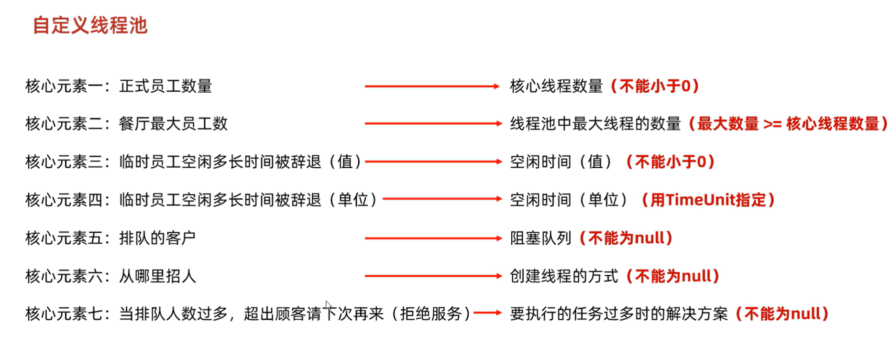

# java-learn
git小贴士：连接的时候要取消http和https的代理：
//取消http代理
git config --global --unset http.proxy
//取消https代理
git config --global --unset https.proxy

正则表达式小贴士: "."表示匹配所有字符，"\\."表示普通".";
"a.".split("\\.")-> [a]; 数组只有一个元素;
".a".split("\\.")->[, "a"]; 数组有两个元素，前一个为 ""。

-字符集: java可以按照指定的字符集读取文件，之后再使用读取到的字符查询自身的Unicode编码对应的字符，展示出来。
       写出也一样，在将某个字符写出到文件时，会那种该字符去查询对应的字符集的编码，将其写出。

-标记型接口: JavaBean类必须实现某个接口(有的接口中并没有抽象方法)才能进行某些操作，比如克隆，序列化。这些接口就是标记型接口。

-在循环的同步代码块中，添加sleep()可以使线程执行一次循环后与其他线程再次竞争，避免某一个线程将结果全部执行完。

-不同的线程开启时会占据不同的栈空间，其调用的run()方法的局部变量存在在对应的栈空间中。

记录java学习
tip:
1.数据的存储和计算都是以补码的形式进行的。

2.在java中，位移操作是针对int和long的，在位移和计算时，char、byte、short的数据都会被自动转换成int类型来操作。

3.只使用两个变量的情况下调换它们的值:{
 a=a+b;
 b=a-b;
 a=a-b;
}

4.条件判断语句更安全的写法:字面量 == 变量；->这样在将"=="写成"="时程序会直接报错，提高程序的安全性。

5.Java中方法是平级关系，不能嵌套定义方法。main方法一般放在最上边，其他方法定义在main方法的下面，并且不需要提前声明（同一个类中）

6.一个标准的JavaBean：

    1.类名见名知意，大驼峰命名法。
    2.使用private修饰成员变量。
    3.至少提供两个构造方法：空参构造和带全部参数的构造方法。
    4.为每一个成员变量提供set和get方法。
    5.如果有其他行为，也要在类中定义。
    
7.Java中键盘录入有两套体系：
    ·第一套：nextInt,nextDouble,next:不接收制表符，空格，回车。遇到制表符，空格，回车就不会接收后面的内容,并且会将其顺延往下。
    ·第一套体系中接收上一个键盘录入的顺延内容时会自动舍弃开头的空格，制表符和回车。（注：只舍弃开头的）
        
    ·第二套：nextLine:可以接收空格，制表符和回车。并且遇到回车才停止接收数据。
    ·由于nextLine接收顺延数据时不会自动舍弃空格，制表符和回车，所以两套混用会导致回车传递而少一次键盘录入。
        
8.创建字符串：
    ·直接赋值创建的字符串对象存储在字符串常量池(StringTable)中，可以复用。每次复用时引用的地址值相同。
    ·使用new创建出来的字符串无法复用。每次new时都会在堆上开辟新空间用于存储此时的字符串。
        
9.String，StringBuilder，StringJoiner：

    ·String:基础操作包括：substring，replace，charAt，equals，toCharArray等，以及字符串不同创建方式导致存储位置的不同。
                    注意事项：键盘录入的字符串属于 new 出来的。
    
    ·StringBuilder:基础操作包括：append，reverse，toString等。
                    应用场景：1.字符串的拼接(不会出现中间量，节省空间和时间)。
                             2.字符串的反转。
                            
    ·StringJoiner:基础操作包括：add，toString等。
                    注意事项：1.构造方法必须带参，一种是只规定间隔，另一种是规定开头，间隔和结尾。
                             2.JDK8提出来的新特性，之前的版本无法使用StringJoiner。
                    应用场景：使用特定场景拼接字符串。

10.String拼接的底层原理：

    ·String s = "a"+"b": 没有变量的拼接：javac在编译java文件时直接生成"ab"字符串，该字符串属于串池，可以复用。
    ·String s1 = s2 + s3: 有变量参与的拼接
                    JDK8之前：先生成一个StringBuilder对象，使用sb.append()，然后使用toString()生成字符串对象。每一个"+"都会导致生成两个对象： StringBuilder 和 String。
                    JDK8之后：系统底层估计本次拼接得到的字符串大小，生成数组，将字符串放入数组中，最后再生成最终的字符串。

11.StringBuilder底层原理：
    ·默认创建大小为16的字节数组
    ·根据添加的内容长度(len)进行扩容：
            len<=16,直接存；
            16<len<=34,扩容到16*2+2=34字节；
            len>34：直接扩容到len字节。

12.static

    ·静态变量属于类，该类的全体对象共享。
    ·静态变量(方法)随着类的加载而加载，优先于对象。
    
    ·静态方法多用于工具类和测试类。
    ·静态方法无法直接调用非静态的变量和方法(没有this关键字)，但是可以在静态方法中构造对象调用。
     public class Teacher(){
         public static void show(){
             Teacher t = new Teacher();
             t.其他方法;
             
             Student s = new Student();
             s.其他方法;
             
         }
     
     }

13.extends
	
	终极父类：Object
	子类与父类的继承关系：
				private		非private
	构造方法	无法继承    无法继承	继承会违背构造方法与类名相同的规则。
	成员变量	可以继承	可以继承	私有的成员变量无法直接调用，但仍然会被子类继承。
	成员方法    无法继承    可以继承	实际上是添加到虚方法表中的方法才能被子类继承。
	
	虚方法表：非private，非final，非static修饰的方法可以添加入虚方法表中，表中的方法可以被继承。
	
	创建子类实例时，会使用一部分内存存储从父类继承下来的成员变量。
	成员变量(成员方法同理)：当子类没有重新定义该变量时，this和super都是指向父类的该变量；当子类重新定义后，this和super指向的变量地址才有区别。
	
	方法的重写(@Override)：本质是覆盖从父类继承的虚方法表中的同名方法。
						 1.只有添加到虚方法表中的方法才能被重写。
						 2.重写的方法尽量与父类保持一致。
						 3.重写方法时子类的访问权限要大于等于父类。
						 4.重写方法时子类的返回值类型要小于等于父类。
						 
	构造方法:子类的构造方法会在第一行默认加上一个父类的空参构造super()，并且super()前不许有其他语句。
	this()(前不许有其他语句):调用子类的其他构造方法，此时该构造方法就不会加上super(),因为调用的其他构造方法会自带super()。
	
	标准的JavaBean：和之前的相同，空参构造、全参构造（包括父类的变量），子类的变量提供set和get方法，需要重写的方法以及子类的特殊方法。
	
14.多态
	
	Animal a = new Dog():调用a.成员变量和a.成员方法
				编译      运行
	成员变量：	Animal   Animal      检查Animal类中有无该变量，实际运行也是输出Animal中的该变量。
	成员方法	Animal   Dog 		 检查Animal类中有无该方法，但由于子类重写覆盖了虚方法表，实际运行的时候是Dog中的重写方法。
	
	优势与弊端：父类类型参数可以接收所有子类对象；但无法调用子类的特有功能(编译看左边)。
	解决方法：强制类型转换：Dog d = (Dog)a;将a转成真正的Dog,这样就可以调用Dog的特有方法了。
	强转的问题：强转类型与实际类型不一致就会报错。
		  解决：使用instanceof: a instanceof Dog;结果返回boolean
		  JDK14新特性：a instanceof Dog d: 当结果判断为true,会自动执行：Dog d = (Dog)a;变量d可以直接使用。
		  
15.final修饰词
	
	修饰类：最终类，无法被继承。
	修饰方法：最终方法，无法被重写。
	修饰变量：常量，只能赋值一次。
	
	修饰常量时
		·基本数据类型：值无法改变。
		·引用数据类型：记录的地址值无法改变，但其内部的数据可以修改。
		·变量单词字母全部大写，多个单词用下划线分割。

17.权限修饰符
	
	 本类     本包的类    其他包子类  所有类
 	private < 默认/不写 < protected < public

18.代码块
	
	·局部代码块：用于方法内，提前结束变量的生命周期。
	·构造代码块：用在方法外，类内部，在调用构造方法时调用，优先于构造方法执行。
	·静态代码块：随着类的加载而只执行一次，用于初始化变量。
	
19.abstract 抽象类和抽象方法：
	
	抽象类：1.不一定有抽象方法，但其子类一定要重写抽象方法；
			2.无法实例化。
			
	抽象方法：1.没有方法体；
			  2.只存在在抽象类中。

20.接口 interface：一种规则
	
	接口多态：接口类作为参数时，可以接收所有实现类对象。
	1.实现类可以实现多接口
	
	2.成员特点： 成员变量：只能是常量，默认使用public static final 修饰;
				 构造方法：没有；
				 成员方法：JDK7之前默认public abstract 修饰;
				 
	3.实现类实现多接口时存在多个重名方法：只需要重写一次就行(接口中的方法都是没有方法体的)；
	
	4.接口之间可以继承，并且可以是多继承。但实现类必须重写子接口以及其父接口的所有抽象方法。
	
	有方法体的方法：默认方法、静态方法、私有方法。
	5.默认方法：显式使用default修饰；实现类可以不重写直接使用，但当实现类实现多接口中出现重名的默认方法，此时必须重写，避免方法冲突。
	注：默认方法是JDK8后新增特性，用于解决接口升级时的兼容问题。
	
	6.静态方法：·显式使用static修饰：直接使用接口名.方法名调用；
				·实现类无法继承，无法重写静态方法。在实现类中的同名方法只属于实现类。
	注：静态方法是JDK8后的新增特性。
	
	7.私有方法(JDK9新特性)：在接口中抽取重复的代码，同时不提供给外界使用。
			  ·无static修饰：提供给默认(default)方法调用；
			  ·有static修饰：提供给静态(static)方法调用；

21.适配器模式

		接口中方法过多，而实现类不需要实现那么多方法，可以使用第三个类：xxxadapter(abstract修饰)
		xxxadapter实现接口所有方法的空重写，同时作为实际实现类的父类，使得实现类可以选择性重写方法。

22.内部类
	
	1.成员内部类可以直接使用外部类的成员，包括私有；而外部类无法直接使用内部类的成员，必须先创建对象。
	
	成员内部类：
	创建实例化对象的方式：1.外部类名.内部类名 变量名 = new 外部类名(). new 内部类名(); 
						  2.当内部类被private修饰，只能使用内部类的方法返回一个实例化对象。
	同名变量调用：外部类名.this.变量名 -> 调用外部类的变量；
				  内部类会与外部类对象一起生成(两个new)，同时内部类中会自动添加一个"外部类名.this"用于指向外部类的地址空间。
	
	静态内部类：
	创建实例化对象的方式：外部类名.内部类名 变量名 = new 外部类名.内部类名(); 直接创建内部类对象。
	静态内部类无法直接调用外部类的非静态变量，需要先创建外部类对象，使用对象来调用。
	调用静态内部类的方法时：非静态方法：使用内部类对象调用；静态方法：外部类名.内部类名.方法名()调用。
	
	局部内部类：创建在方法中的内部类。
	1.外界无法直接使用，需要在方法中创建对象使用；
	2.该类可以直接访问外部类的成员，也可以访问方法内的局部变量。
	
	※匿名内部类：
	1.创建方式： new 接口/类(用于带参构造的参数){
							重写方法
							};
	2.整体包含三个特性：1.实现/继承；2.方法重写；3.创建对象。
	3.匿名内部类并非没有名字，虚拟机运行后会自动生成该类的class文件：Test$1.class。
	4.使用场景：方法的参数是一个接口或类时，可以传递实现类或子类对象，如果该类只需要使用一次，就可以用匿名内部类简化代码。
		如：method( new Animal(){
			@Override
			public void eat(){
			System.out.println("吃东西")
			};
		);
		
	5.可以使用接口名/父类名 变量名 = new 接口/类(){重写方法1,重写方法2,......};来接收匿名内部类对象。
	6.关于匿名内部类的成员特点：没有构造方法，所以创建匿名内部类的成员变量意义不大；
								同时由于编译看左边的原因，匿名内部类的成员方法也无法使用 类.方法名 调用，只能在重写的方法中调用。
				
23.Object类：关于equals方法，toString方法，clone方法

	·toString方法可以重写：返回对象的属性值。

	·equals()方法可以被重写，在Object类中比较的是两个对象的地址值，重写后可以比较两个对象的属性值。
	·在String类中重写了equals方法：
		s.equals(Object obj)：先判断obj是否为String类型，再判断obj与s的内容是否相等；
	·非String类型：如果类中没有重写equals方法，那么obj1.equals(obj2);比较的就是两个对象的地址值。

	·clone需要重写，而且要实现接口说明该类能被克隆。
		重写时直接调用Object的clone方法实现的是浅克隆；深克隆需要重写方法或者调用第三方工具类。
	区别：
	           基本数据类型            引用数据类型                
	浅克隆      直接赋值        与本体共享同一个地址的数据
	
	深克隆      直接赋值        使用另外的地址空间，将本体指向的地址内容赋值到自己创建的地址空间中
	注：String会复用串池。

24.Objects工具类：equals，isNull，nonNull
	
	equals(a,b):方法自身会判断a是否为null，避免空指针调用方法的错误；
	            当a非空，会调用a中的equals方法：没有重写就比较a与b的地址值；重写就根据重写的内容判断。
	
	isNull(a)：判断a是否为null;
	nonNull与isNull结果相反。

25.BigInteger:一个可以存储超大数类
	
	1.可以进行类似数字的加减乘除、次幂、比较等操作，也可以转换回整数/小数（不能超过该数的范围）
	2.获取方法：三种构造方法和一个静态方法返回。
				静态方法：[-16,16]:返回常量对象。
	
26.BigDecimal：存储较大小数、解决小数精度丢失的问题

	·精度丢失:Java存储小数时会先将其转换成(1.010101...*(2^e))形式。
			  以double：64bit为例：需要存储符号位，指数e，以及尾数M(1.010101...);
			  其中，当M位数过大，超过存储位数，就会导致精度丢失。
	·BigDecimal有三种获取对象的方式：
		1.使用传递小数的构造方式：传递的小数可能不准确，导致BigDecimal存储的值也不准确。
		2.传递小数字符串的构造方式：能构造出精确的BigDecimal。
		3.使用静态方法返回（精确，但无法传入大于double类型的数）：
			3.1 传递小数：无论小数值是多少，都构造新BigDecimal并返回。
			3.2 传递整数：[0~10]之间返回一个常量对象，其他值需要构造新BigDecimal并返回。
	·可以进行加减乘除操作，除法操作可以指定结果的位数以及舍弃方法。

27.BigInteger和BigDecimal存储方式的不同
	
	BigInteger:1.先转换成二进制补码；
			   2.从右到左每32位分组，每一组就是一个int类型的数；(分段)
			   3.将分组后的补码转换回int类型；
			   3从左到右依次存入一个int数组中。
	
	BigDecimal:1.将数字拆分，如 -17.25 -> ['-', '1', '7', '.', '2', '5'](正数不需要存储符号位)
			   2.将每个位置对应的ascll值存入一个int数组中。
	
28.正则表达式
	
	1.在正则表达式中使用一般的'\',需要使用"\\",前一个'\'将后一个'\'转移成普通的'\';
	2.爬虫: Pattern p = Pattern.compile(regex) -> 正则表达式对象，
			Matcher c = matcher(text) -> 文本匹配器对象
			c使用p规则在text中寻找满足的子串：c.find();c.group();
			
	3.有条件的爬取，但只获取部分子串: "((?i)Java)(?=8|11|17)"
        ?i:忽略大小写
        ?：表示前面的子串：((?i)Java)
        =：?后要跟随的数据，但获取group()的时候只获取?
	
	4.爬取时获取整串:"((?i)java)(?:8|11|17)" 等价于 "((?i)java)(8|11|17)"
	
	5.爬取的时候不要某些特定的符号："((?i)java)(?!8|11|17)"
      !:表示当(?i)java后面跟随的是8|11|17时，一整串视为不匹配
	  find()为true时，group()只返回?,即：java5满足，但group() == "java"

	6.贪婪匹配与懒惰匹配：在+、*、{m,n}等后面加上?，如+?，就从贪婪匹配变成懒惰匹配。

	7.字符串的replaceAll和split方法：使用正则表达式将字符串中的子串进行替换，或者根据正则表达式来分割字符串。

29.捕获分组
	
	·在正则表达式中：使用()围起来的一组表达式会被视为一组；
	·组号由其左括号的顺序决定：(a(b)): \\1代表:a(b); \\2代表: (b);其中,\\n表示的组在regex中可以复用：(a)\\b == aab
	
	·在正则表达式外使用分组：$组号；str.replaceAll("(.)\\1+","$1");表示使用(.) 替换 (.)\\1+
	·非捕获分组：?!、?:、?= 当使用类似于(?:xxxx)的形式时，该括号不是一个组，不占组号，无法复用。

30.世界标准时间 GMT(格林威治时间，有误差) -> UTC(铯原子钟，误差可忽略)
31.Data d = new Date();获取当前系统的时间
32.SimpleDateFormat:格式化时间
33.JDK8后新增的时间对象不可变，创建新时间时会返回新的对象
34.JDK7的Calendar中月份是从0-11，而JDK8的LocalDate是1-12。
	......
	
35.包装类：基本数据类型的对象类

		·只有char和int比较特殊，其他都是首字母大写；
		·Integer类(Int的包装类):
			JDK5之前使用构造方法和静态方法来获取；并且静态方法可以获取值为-128~127的常量Integer对象。
			但是JDK5之前Integer进行加减等操作需要先转换回int类型，再将结果转换回Integer；
			JDK5之后碰到相关操作时JVM会自动转换int和Integer类型。
		
		包装类的一些方法：Integer.to进制String(int num); 将num转换成对应进制，并返回其字符串形式；
		(除了char):返回对应的基本数据类型：包装类.parse基本数据类型(data);

36.数据结构

    查找
    -基本查找：按顺序查找；
    -数据已经排好序：
        -二分查找：要求数据已经排好顺序，每次查找数据集减半；
        -查找查找：要求数据集排序且分布均匀，查找的时候midIndex= min + (key-arr[min])/(arr[max]-arr[min]) * (max-min)
    	-斐波那契额查找：使用黄金分割点来计算midIndex的位置
    -数据在整体上是有序的，但在局部无序
        -分块查找：整体上按某个顺序：将数据分块，块内无序，但前一块的最大值小于后一块的最小值。那么记录块的起始与结束索引以及最大值并放入索引表中即可；
        -整体也无序：将数据分成没有交集的块，记录每块的起始和结束索引，最大值和最小值，并放入索引表中即可。
    -哈希插入(查找)：将容器均匀分块，每块记录某一范围的值，并用链表连接。

    排序(以从小到大排序为例)
    -冒泡排序：索引递增，每次都拿着arr[i]与arr[i+1]比较，将大的值放在arr[i+1],每一轮都将剩余数据中最大值放在了maxIndex-i的位置。
    -选择排序：索引递增，先固定i，拿着arr[i]与所有的数据比较，将最小值放在arr[i]，每一轮都将剩余数据中的最小值放在了index=i的位置。
    -插入排序：将数据分成有序与无序两个块，然后将无序数据一个一个地插入有序数据中。
    -快速排序：(递归调用)选择数据集的第一个数据为基准数，第二个为start，用来寻找比基准数大的数据；最后一个为end，用来寻找比基准数小的数，交换start和end记录的数，直至start==end,此时交换基准数与start指向的值；
             每一轮都可以得到两块数据集，一边大于基准数，一边小于基准数，对这两块数据集执行相同操作。

37.Arrays:用来操作数组的类，无构造方法，方法使用静态调用。

38.lambda表达式: 用来简化函数式接口的匿名内部类的面向过程式编程
    
    ·表达式：(形参1, 形参2, ......)->{方法体};
    ·使用前提：必须是接口的匿名内部类，接口中只有一个抽象方法。该接口可以用@FuntionalInterface来修饰
    ·好处：使代码风格更加紧凑、灵活、简洁。
	·简化写法：形参类型可不写，方法体只有一行代码时可以省略{}、return、和;（三个要一起省略）;

39.单列集合Collection：（单列集合：一次只存入一个数据）
        
    单列集合的顶级接口：Collection；双列集合的顶级接口：Map
        -contains(Object obj):底层依赖equals方法，如果集合中添加的是自定义类，需要依据特定数据判断是否存在，就要在类中重写equals方法。
        -通用遍历方式：(遍历过程想要删除元素，就用迭代器Iterator)
            -迭代器Iterator：使用hasNext方法判断当前位置是否有元素，Next方法获取当前位置的元素返回并将指针指向下一个位置
                -迭代器细节:1.当指针指向集合之外后在调用next方法会导致：NoSuchElementException
                          2.next和hasNext要配套使用，否则容易导致NoSuchElementException
                          3.迭代器遍历完后指针不会复位，再次遍历需要一个新的Iterator
                          4.迭代器遍历时不能使用集合的方法对集合进行增删操作，只能使用Iterator.remove()对当前next返回的元素进行删除操作。

                -增强for:enforce for:只有数组和单列集合能使用。JDK5后用来简化迭代器格式的
                        for(Object obj:集合名/数组名){
                            //obj是一个临时变量，用来临时存储当前遍历得到的value。
                        }

                -lambda遍历(JDK8)：集合.forEach(new Consumer<String>() {
                                             @Override
                                             public void accept(String s) {
                                                    方法体;        
                                             }
                                          });
                    底层自动遍历集合中的每一个元素，并将其传入accept方法作为形参,所以可以写成：.forEach(s -> {方法体});

        -list系列集合：可重复，有序，有索引; List作为顶级接口，继承于Collection
            -由于有索引，所以添加了几个能用索引进行操作的方法
                -add(int index):在指定索引处进行添加，添加后会将该索引后的其他元素索引+1。注：指定添加的索引位置不能超过当前list最大索引+1(list.size())
                -独有的遍历方式：
                    -ListIeterator: 1.可以使用add方法在当前指针指向的索引处添加元素; 
                                    2.可以使用previous与其对应方法反向遍历list(将指针反向移动)。
                    -普通for遍历：使用get(index)获取对于索引处的元素，进行遍历。

        -set系列集合：不可重复，无序，无索引

40.数据结构
    
    -栈：数据满足先进后出，后进先出的原则。
    -队列：数据满足现金先出，后进后出：由队头指针控制出队，队位指针控制进队。
    -数组和链表：
        -区别：
            -存储方式：
              数组在内存空间中是一块连续的地址，数据存储在相邻的地址中
              链表的数据是游离的，依赖于单个元素中记录的下一个元素地址值链接(element: {data, nextAddress})
            -查找效率：
              数组只要提供首地址和setoff就可以快速找到要查找的数据，效率较高。
              链表无论查找哪个数据，都需要从链表头(双向链表可以从尾部开始查找)开始挨个查找，平均效率较低。
	        -增删效率：
              数组的增删会导致其指定索引处后面的元素挨个后移或者前移，时间复杂度为o(n)，效率较低。   
              链表的增删只需要在指定位置处改变前一个元素记录的nextAddress以及被添加元素记录的nextAddress即可，时间复杂度为o(1)，效率较高。
	
41.ArrayList底层机制(扩容)：List的实现类。ALT+7看类结构

    -ArrayList的数据结构是一个数组elementdata，在使用空参构造创建的时候elementdata被赋值为长度为0的空参数组。
    -此后add分两种情况：
        -添加第一个元素的时候底层会调用add、newLength、grow等方法进行扩容至长度为10，
         每次添加满了就会将创建一个长度为老数组的1.5倍的新数组，并赋给elementdata，之后将新元素添加值新数组中。
        
        -一次添加的数据过多:
            -第一次就添加超过10个数据：创建实际容量大小的数组并赋给elementdata；   
            -之后添加的数据超过(oldArrLength*1.5 - oldArrLength)，那么直接创建一个新数组，length为实际需要的大小，并赋给elementdata。

42.LinkedList:List的实现类，一个双向链表。

    -定义了一个内部类node:{ prev:前一个节点的地址值; item:当前节点数据 ; next:后一个节点的地址值}
    -定义了一个first指向链表头，一个last指向链表尾。

43.迭代器的实现原理：迭代器是Array的一个内部类
    
    -记录三个变量：{cursor:当前索引位置; lastRet:上一次操作的索引(cursor-1); expectedModCount:记录当前集合操作的次数ModCount（用来校验并发异常）}
    -hasNext:return cursor!=集合长度; 用于判断当前索引指向是否超过集合。
    -next:1.先执行checkForComodification():判断expectedModCount==ModCount;保证迭代器遍历集合的时候没有对集合进行操作。
          2.记录i=cursor,对当前索引位置进行判断，
            true：
                执行cursor++, return elementdata[lastRet = i];
            false:
                抛出异常。

44.泛型<数据类型>	：JDK5之后出现的。
        
    作用：统一数据类型。
    细节: 1.由于运行的时候还是转换成Object类型，所以不能写基本数据类型，只能写引用数据类型。
         2.泛型指定类型后，可以传入该类类型与其子类类型(不推荐)。
         3.不写泛型，默认是Object

    泛型类：public class 类名<E>{
        //E是全局泛型。
        //当编写类的时候不确定类型，就可以使用泛型，该类就是泛型类。
        //泛型类的类型由创建对象时传入的数据类型决定。
    }
	
	泛型方法：public <E> 返回值 方法名(E e, ......){方法体}
        //<E> 定义在修饰词后，返回值前。
        //局部泛型，本方法中可以使用。

    泛型接口: public interface 接口名<E>
        //实现类：1.实现类直接确定具体类型，那么创建方法的时候就不需要再指定泛型类型了。 实现类 implement 接口<具体类型>{}
                2.实现类延续泛型，此时创建对象的时候还要指定类型。 实现类<E> implement 接口<E>{}
    
45.定义方法时不确定变量的数量：public ..... 方法名(E...e){}: e：一个接收不确定数量参数的数组。 调用方法的时候就可以传入不定数量的变量。
	
46.泛型的通配符：?

    -由于泛型无法继承，在定义泛型的时候会导致传入的数据类型范围过大或单一：
        -(ArrayList<E> list):能接收所有数据类型的集合； 
        -(ArrayList<Animal> list):只能传递Animal类型的集合，无法传递包括其子类、父类在内的其他类型的集合。
    -使用泛型的通配符可以解决这个问题：
        -? extends 某类：这个泛型可以接收该类以及该类的所有子类；
        -? super 某类：这个泛型可以接收该类以及该类的所有父类；
	
47.树

    -度:该节点的孩子数：度<=2的树称为二叉树。
	-普通二叉树：数据存储没有规律；该树没有什么实际应用价值。
    -二叉查找树：左子节点小于根节点，右子节点大于根节点。 
    -平衡二叉树：在二叉查找树的基础上规定：任意节点的左右子树高度差不超过1。
        -添加节点导致平衡被破坏，需要进行左旋/右旋
            -左/右旋: 1.从插入节点开始，向上寻找出第一个不平衡的节点
                     2.以该节点为支店进行旋转
        -导致平衡的操作以及对应的旋转方式：
            -根节点的左子树的左子树插入(简称左左，以下同理)：一次右旋
            -左右：一次局部左旋，再整体右旋
            -右右：一次左旋
            -右左：一次局部右旋，再整体左旋

    -遍历方式：按照当前节点(根节点)被遍历的顺序排列
        -前序遍历：根->左->右
        -中序遍历：左->根->右 (得到的数据是从小到大排列的)
        -后序遍历：左->右->根
        -层序遍历：按照层级，以此从左到右遍历。

48.红黑树(B树)

        -红黑树增删改查的性能都比较好
        -与平衡二叉树相比，不是高度平衡的，而是通过红黑规则来平衡的

49.set单列集合：继承Collection接口
    
    -HashSet:无序、不重复、无索引；
        -底层使用哈希表存储数据：
            相同点：
            1.构造HashSet对象时底层自动创建一个默认长度为16、默认加载因子为0.75的table数组。
            2.存入数据时先使用地址值和hashCode方法计算哈希值；
            3.使用哈希值 & (数组长度-1) 得到该数据应该存储的位置。
            4.若当前位置为null，则直接存入；如果当前位置存在数据，调用equals判断该数据是否以及存在：存在，不存入 。 
                                                                                     不存在，存入。
            5.扩容机制：当数组中存入的位置数达到(>=)当前长度*加载因子(第一次是12),table自动扩容至现在的两倍长度。

            区别：
            -JDK8之前:数组+链表；挂链表的方式：新元素存在数组中，挂着老元素。
            -JDK8之后:数组+链表+红黑树：老元素存在数组中，挂着新元素。
                     同时当 (某一link.len>8 && table.length>=64),该链表自动转换成红黑树。
                
            注意：当集合中存储的是自定义类型对象，应该重写hashCode和equals方法：保证当某些属性值重复时就不再存入。
            -无序的原因：遍历的时候是根据数组索引来依次遍历每个链表，先存入的数据所在的链表不一定靠前。

        -哈希值：使用hashCode计算出来的一个int值。
          一般使用的时对象的地址值，所以计算出来的结果一般也不相同；
          重写hashCode方法可以使用对象的属性值来计算哈希值。
        -哈希碰撞(小概率事件)：两个不同的对象计算出相同的哈希值。

50.LinkedHashSet:继承于HashSet。
    1.有序、不重复、无索引。
    2.实现有序原理：存储数据与HashSet相同，但是存入数据的时候会维护一套双链表机制，用来记录数据存入的先后，保证遍历时按照存储数据的顺序来读取

51.TreeSet:可排序、不重复、无索引
    
    -底层是红黑树的数据结构实现排序(按照元素的默认规则(从小到大)排序)，增删改查效率较好。
	-Integer、Double、Character等从小到大排序。
    -String:从第一个字符开始比较(ASCLL值)，ASCLL值更小的放在前面。
    -自定义类型：
        两种方法的使用场景：1.当使用自定义类型时可以使用方法一，在类中规定排序方式。
                        2.使用java中已经规定好的类，如String、Integer等已经重写过compareTo方法，
                          规定了排序方式时，我们想要按照自己的要求排序，可以使用第二种方法：比较器，规定排序规则。

※注: comparator(比较器)的优先级大于compareTo(实现接口)

        方法一：默认的排序规则/自然排序
        实现Compareable<T>接口，重写compareTo方法：
        compareTo(T t){
            return this.属性值 - o.属性值;
            /*使用当前数据的某一个属性进行比较：
            *使用当前正在存入的数据与当前节点数据进行比较：
            * >0:当初存入数据大于节点数据，存入右边；
            * <0:当初存入数据小于节点数据，存入左边；
            * ==0:当前存入数据已经存在，舍弃。
            */
        }

	    方法二：使用比较器Comparator指定比较方式
        TreeSet<数据类型> ts = new TreeSet<>(new Comparator<Object>() {
            @Override
            public int compare(Object o1, Object o2) {
                //o1:this
                //o2:当前比较的节点
                return 0;
            }
        }
        等价于：
        TreeSet<数据类型> ts = new TreeSet<>((o1,o2) -> {方法体});
        return的值规则与自然排序相同。

52.总结：单列集合关系集：
.png)
       
53.如何选择集合(单列)：

54.双列集合：entry
    顶层接口：Map()
    1.使用键值对；
    2.键唯一，值可以重复。

55.Map体系方法：
    
    构造方法(多态): Map<K, V> map = new HashMap<>();
    v put(K key, V value);
    添加：当put的key存在时，是添加，返回null;
    覆盖：当put的key存在时，使用新value覆盖原来的value，并返回旧value;

    void clear();
    V get(key);
    boolean containsKey(key);
    boolean containsValue(value);
    boolean isEmpty();
    int size();

56.Map集合的遍历方式：
    1.键找值：keySet();
    2.键值对（entry）：entrySet();
    3.lambda

57.HashMap:Map的一个实现类
    
    无序，不重复，无索引；存储entry对象，但只考虑key值，不需要考虑value；
    -底层原理与HashSet一样，包括结构(数组、链表)，JDK8的新特性(红黑树)，存储方式，扩容机制等。
     唯一区别：当key哈希值相同：新entry会覆盖旧entry。(HashSet是舍弃)

    -对于自定义对象的位置:key:重写equals和hashCode,保证key的哈希值与比较规则。
                      value：不需要重写。
    
58.LinkedHashMap:HashMap的子类
    特点：有序，不重复，无索引。 
    与LinkedHashSet类似，元素之间维持一套双向链表，用来保证读取元素时顺序与存储顺序相同。

59.TreeMap：与TreeSet结构类似，使用键key来进行排序，构建一个红黑树结构。

60.Java类一些基础知识：c:类, f(field):成员常量或变量，m:成员方法(↑class：重写的该类/接口的方法、→class:继承的该类/接口的方法)。
        
源码详解：对于Map的put方法，也存在键重复时value不覆盖而使用old value的方法：putIfAbsent.   

HashMap:JDK8后维持的红黑树不需要传递比较规则：
        HashMap判断红黑树节点大小的顺序为：先比较哈希值，若哈希值相同则比较键的compareTo方法(没有实现就直接跳过)，
        若仍无法区分则比较原生哈希码(内存地址计算得到的)，最后使用兜底的tieBreakOrder方法。
    
    1.底层与HashSet相同，但不会在一开始就创建默认数组。
    2.数组的创建时机：第一次调用put函数，会创建一个长度为16，默认加载因子为0.75的数组并赋值table(HashSet底层数组)
    3.在put方法调用putVal方法：创建一个临时数组tab记录HashMap的成员数组，这样做的的好处：
        -当需要多次访问该数组时，tab是一个方法创建的临时数组，保存的数组的地址在栈上，可以在栈地址上直接访问数组；
        而成员变量table是随着对象被创建的，存储在堆上，访问数组时需要先通过堆上对象的地址值+偏移量访问table获取数组地址值，才能访问数组。
        -当发生异步操作时，原table被修改了，可以保证当前操作的tab数组没有发生改变。

    4.通过添加元素的键值获取哈希值，并与数组的最大索引进行异或操作，获取要存放的位置。
        -存放位置为null:
            直接创建新node记录当前元素的hash，key，value并添加入数组中，判断当前数组中非null是否小于扩容阈值，满足则扩容，不满足则返回null；
        -存放位置存在元素，并且键不重复，挂在下面形成红黑树/链表：
            首先判断当前键值对的hash值与已存在键值对的hash(一般键不同，hash就不同)，
            再判断已存在节点是否为树节点，如果是，则执行putTreeVal，尝试将新的节点添加入树中，
            如果不是，则执行添加链表的函数：依次判断当前节点的下一节点是否为null，添加节点。
            最后判断添加后的数组长度&链表是否满足变换成红黑树的要求。
        -存放的位置存在元素，并且hash相同：
            当hash相同时，还要判断当前节点的key与要添加的key是否相同(包括基本数据类型的"=="，以及引用数据类型的equals);
            当满足hash&&key都相同，就会执行覆盖：
                将要添加的键值对中的new value赋值给当前节点的value，同时返回old value;
                可见,覆盖不是创建新节点覆盖老节点，而是将老节点的value覆盖成新value，节点的地址值不变。
TreeMap:

    1.第一次添加时会创建节点并将该节点置为根节点；
    2.在后续的添加中分为有比较器和无比较器，当过程类似，以无比较器为例：
        2.1 将key强转成Comparable类型(这也是为什么自定义类中没有实现Comparable接口，被添加入TreeMap时报错的原因：无法完成强转)
        2.2 得到要添加的key和当前节点的key比较结果：
            ==0：则执行覆盖，与HashMap相同；
            >0:将当前节点换成其右孩子；
            <0:将当前节点换成其左孩子； 
        2.3 判断当前节点是否为null：null:执行添加函数(addEntry)；非null则循环2.2
        2.4 在addEntry函数中，添加完毕后会执行fixAfterInsertion：调整树的结构。
61.可变参数: 数据类型...变量名; JDK5之后的新特性。
    
    --底层原理是一个数组，作为形参时可以接收不定数量的变量；
    --由于可变参数会接收传入的所有多余变量，所以只能放在形参列表最后，这也使得形参中只能有一个可变参数。

62.Collections:单列集合的工具类，具体使用查阅API帮助文档。

63.不可变集合: 一旦创建，无法修改(增删改)，只能读取。
    
    -List.of(E...e):List; 任意传入参数，返回一个List集合。
    -Set.of(E...e):Set; 任意传入参数，但参数不能重复，否则会报错，返回一个Set集合。
    -Map.of(k1,v1,k2,v2,......):传入的参数依次为：键,值......; 不能传入相同的键，否则报错；
        Map.of()最多接收10个键值对：受限于方法构造时可变参数只能传递一个，此时无法将键和值都设为可变参数。
        -Map.ofEntries(E...e):可以接收可变参数，使用数组传递。
            1.使用HashMap/TreeMap创建一个Map集合, 向集合中传递键值对
            2.提取Mao集合中的键值对Entyies，转换成Set：Map.entrySet();
            3.调用单列集合的toArray方法，将entrySet装好成一个数组，同时指定数组的类型：
              Map.entry[] arr = entries.toArray(new Map.entry[0])
                当传入的数组长度小于entries的长度，会根据实际长度需要创建新数组；
                当传入的数组长度够用时，不会创建新数组，而是直接使用传递的数组。
            4.将arr传给Map.ofEntries(),返回一个Map不可变集合。
        链式编程：Map.ofEntries(map.entrySet().toArray(new entry[0]))
        JDK10:直接使用Map.copyOf(hm)即可返回一个不可变的Map集合。
    
64.stream流：结合lambda，简化集合/数组的操作。
    
    能使用stream的数据：
        1.Collection：默认的stream方法
        2.双列集合无法使用，需要keySet/entrySet，调用Collection的stream方法
        2.Array：Arrays中的静态stream方法
        4.零散的同数据类型数据：Stream.of(T...value)

        注意：使用第4中方式可以传递数组当中stream流，传递引用数据类型数组没问题，
        但是传递基本数据类型的数组就会出错：Stream.of(arr)会将这个数组的整体当成一个元素，遍历打印的结果是该数组的首地址值。
-Stream流的常见的中间方法(方法会在返回stream流)：
    
    -特殊说明：1.中间方法生成的stream只能调用一次，第二次调用就会报错：stream has already been operated upon or closed。
             2.stream流不会对原集合/数组/数据等产生影响。
    -filter过滤器：筛选返回值为true的元素。
    -limit(n):留下前n个元素，其他舍弃。
    -skip(n):跳过前n个元素，后面的保存。
    -distinct:去重;底部依赖HashSet，也就是说，依赖HashCode和equals方法。
    -concat(Stream a, Stream b):合并，注意点：如果a、b不是相同数据类型，则合并后的数据类型为a、b类型的共同父类
    -map:类型转换：Stream.map(new Function<原数据类型, 要转换的类型>() {
            @Override
            public 转换类型 apply(原类型 s) {
                return null
            }
        })
    lambda:Stream.map(s -> return null);
-Stream的常见的终结方法

    -forEach：遍历得到每一个元素。
    -count():Stream流中元素的个数。
    -toArray():转换成数组：
        1.toArray():空参：返回一个Object类的数组。
        2.带参：toArray(new IntFunction<元素数据类型[]>() {
            @Override
            public 元素数据类型[] apply(int value) {
                return new 元素数据类型[value];
            }
        })
        lambda：toArray(value -> new 数据类型[value];)
        特别说明：value为该stream中元素个数，返回的数组长度只能填value,或者与之等价的数字。
        
        -常用的收集方法：collect:将stream流转换成集合：List、Set、Map
            Stream.collect(Collectors.to集合()); 调用Collectors工具类的静态方法创建对应的集合
            List:对元素没要求；
            Set:底层是HashSet,会对元素自动去重；
            Map:添加的键值不能重复，否则报错:Duplicate key xxx (attempted merging values xx and xx)
                Collectors.toMap(key的规则, value的规则);
                具体如下：
                Stream.collect(Collectors.toMap(
                        new Function<流中数据类型, 键的数据类型>() {
                            @Override
                            public 键的数据类型 apply(流中的元素 obj) {
                                return 键;
                            }
                        }
                        ,
                        new Function<流中数据类型, 值的数据类型>() {
                            @Override
                            public 值的数据类型 apply(流中的元素 obj) {
                                return 值;
                            }
                        }));

65.方法引用：使用已经存在的方法作为函数式接口抽象方法的方法体
    
    -引用格式
        静态方法: 类名::方法名
        成员方法:  对象::方法名
            其他类: 其他类对象::方法名
            本类: this::方法名
            父类: super::方法名
            静态方法中没有this和super，所以无法在静态方法中引用成员方法
        构造方法: 类名::new; 
        该类中必须有对应的接收流元素数据类型的构造方法
  
    "::"-方法引用符

-特殊引用：
    
    -类名(必须与第一个形参类型对应)::成员方法
    类似于：形参1.成员方法(形参2, 形参3,......)
    抽象方法参数说明: 1.形参1:一般是流中的每一个元素,类名对应"形参1"的数据类型；
                   2.形参2-形参n:对应成员方法的形参1-形参(n-1); 
                   3.返回值类型要一致。
    局限性: 成员方法只能是第一个参数类的成员方法，如果这个类中没有能完成功能的方法，就不能使用；
           而对象::方法名，可以引用所有类中的方法。
    list.stream().map(String::toUpperCase):
    String对应抽象方法的第一个参数的数据类型(获取的流元素String s);
    toUpperCase:对应抽象方法的引用方法(String类的方法)，
                其形参对应抽象方法除第一个参数外的所有参数(本例无)，
                其返回值对应抽象方法的返回值。
    
    -引用数组的构造方法: 数据类型[]::new == new 数据类型[value]    

使用条件
    
    1.引用处必须是函数式接口；
    2.被引用的方法必须存在(已经定义好)；
    3.被引用的方法形参与返回值必须与抽象方法一致；
    4.被引用的方法必须满足当前的需求。

66.Throwable:所有异常或错误的父类
    
                               Throwable
                        Error(错误)     Exception(异常)
        
67.Exception: 
    
    子类：
    1.运行时期异常：RuntimeException以及其子类
        -在程序运行的时候导致的异常        

    2.编译时期异常:编译时就出现的异常，需要手动处理；
        -提醒Coder代码出错，需要直接修改。
        -提示代码优化，调高性能。
    
    作用
    1.查询bug的关键参考信息。
    2.作为方法内部一种特殊的返回值，告知调用者底层的执行情况。
-异常处理：
    
    1.JVM默认处理: 将异常信息用红色字体打印在控制台，并停止程序，不执行后续的代码
    2.捕获异常(自己处理):
        try{
            可能出错的代码 //出现异常时程序会创建一个异常的对象，并与catch中的类型比较
        }catch(异常类名 异常变量){
            
        }
    -捕获多个异常时，父类异常要写在最下面，避免父类捕获所有子类异常
    -JDK7之后可以同时捕获多个异常: catch(异常类名1 | 异常类名2 | ......  e){  异常处理  };
    -如果catch没有捕获到异常，就会交给JVM处理: 打印错误信息，并停止程序。
    
    3.抛出异常(交给调用者处理):
        throws:在方法定义时声明，该方法可能会遇到的某些异常，运行异常类不需要写，编译异常类需要手动加上。
        throw: 将生成的异常抛出，并停止方法的运行，返回调用处。

    一般抛出异常后，在调用处使用try-catch来捕获

-Throwable的一些方法:
    
    -getMessage:以字符串形式返回异常的原因
    -toString:以字符串的形式返回异常的类型+异常的原因
    -prinkStackTrack:调用System.err.println; 以红色字体在控制台打印最详细的错误信息。
        prinkStackTrack与虚拟机默认处理的区别：不会停止程序运行，可以继续执行try-catch之外的代码。

    System.err:以红色字体打印; System.out:以普通字体打印; 同时调用可能会出现打印顺序不一致的情况
-自定义异常：让控制台的报错信息更加见名知意
    
    1.自定义异常类: 要做到报错的信息与类名有关系
    2.继承关系: 运行异常就继承RuntimeException, 编译异常就直接继承Exception;
    3.空参构造和带参构造。

68.file:表示路径，可以是文件/文件夹，该路径可以存在，也可以不存在。
    
    构造方法
    1.public File(String road); //将road字符串变成File对象，以便调用方法操作该路径的文件。
    2.public File(String parent; String child); //将父级路径和子类路径进行拼接
    3.public File(File parent; String child); //将父级路径和子类路径进行拼接
    调用构造方法1手动拼接时，需要考虑本操作系统文件连接符
File的常见方法：

-特别说明：
    
    -已经存在/创建失败:false; 使用该方法成功创建:true;
    -createNewFile():只能创建文件，不能创建文件夹->导致只能在已经存在的路径上创建文件(可以不指定文件类型)。
    -mkdir/mkdirs:mkdirs在只创建单级文件夹的时候会调用mkdir方法，只有创建多级文件夹的时候会调用自己的方法.
    -delete:1.直接删除，不经过回收站；
            2.只能删除文件&空文件夹，即使文件夹中只存在空文件夹，该文件夹也不能直接删除。
    
    -listFiles()->File[]:获取当前文件夹下所有文件/文件夹的file对象
        1.调用者表示的路径不存在/调用者的路径表示的是文件/调用者表示的路径需要权限：return null;     
        2.调用者表示的路径为空文件夹: return File[0]; 返回一个长度为0的数组；
        3.会将隐藏的文件/文件夹返回。

69.IO流:读取、存储文件的解决方案。
    
    -输入流：文件->程序；输出流：程序->文件
    -操作文件的类型：   
        字符流：只能操作纯文本文件(windows自带的记事本打开，人能读懂的)；
        字节流：可以操作所有类型的文件。

70.字节流:可以操作所有类型文件
        
    OutputStream:字节输入流的抽象类。
    子类：
        -xxxOutputStream:操作xxx的字节输入出流;
        FileOutputStream:操作文件的字节输出流：
        1.创建对象：
            -参数是字符串表示的路径 or File对象都可以。
            -当文件不存在时会创建一个新的文件，但是要保证父级路径存在。
            -如果文件存在，则清空文件。
            -不清空，续写文件: 创建对象时向构造方法传递"true", 将append的默认值false替换。

        2.往文件写入数据；
            -write();参数传入整数，写到文件上的是对应的ASCLL字符。
            -write(int i); 一次写入一个字节；
            -write(byte[] array); 一次写入一个字节数组的数据；
            -write(byte[] array, int startIndex, int len); 一次写入一个字节数组的部分数据；
            -增加换行符:
                Windows: \r\n
                Linux: \n
                MacOS: \r
            String wrap = "\r\n"; 
            byte[] arr = wrap.getBytes();
            fos.write(arr);

        3.关闭文件连接。
            -防止占用资源。

    InputStream:字节输入流的抽象类。
    子类：
        -xxxInputStream:操作xxx的字节输入流;
        FileInputStream:操作文件的字节输入流
        1.创建对象: 
            -文件不存在，直接报错；

        2.读入数据:
            -read():一次读取一个字符，返回其ascll对应的int值，指针后移一位。
            -当read()读取不到数据(读完了)，返回值为-1。
            -read(byte[])：根据数组大小来决定一次读取的字节数量。

        3.关闭文件连接
            -防止占用资源

71.文件拷贝

    使用FIS和FOS可以实现对文件的拷贝，但read()空参每次只读取一个字节，效率太低。
    -使用len = read(byte[] arr): 
        1.读取字节的数量由数组的大小决定，read每次尽量读取能完全装满arr的字节数。
        2.返回值为此次读取到的字节数量。
        3.读取得到的字节会从arr[0]开始覆盖数组。
        4.当读取不到数据的时候返回 -1；
        5.byte[] arr不应太大，会占据内存空间，应该为1024的整数倍。
    -使用write(byte[] arr,0,len):
        1.不能只使用arr，因为最后一次读取的时候不一定能完全装满arr，会有无效数据。
        2.通过read的返回值len来控制一次写入的字节数量。

72.try-catch-final:
    
    try{

    }catch{

    }finally{
    无论是否抛出异常，执行完try或者catch中的代码，都一定会执行fianlly中的代码；
    一般在此处释放资源，不过一般是抛出处理，不会使用try-catch体系。
    }

-AutoCloseable:
    
    --创建IO流需要释放资源，JAVA引入新特性自动释放资源
    JDK7: try(创建对象1;创建对象2;......){
          }catrch(){}; 不需要手动释放。
    
    JDK9: 创建对象1;
          创建对象2;
        ......
        try(对象1;对象2;......){
        }catch(){};不需要手动释放。

73.编码规则
    
    -ASCLL: 英文字符集，只有128(0-127)个字符；
    -GB2312-80/BIG5: 简体中文字符集/繁体中文字符集；
    -GBK: 包含上述所有字符+日韩汉字的字符集。也是简体中文版Windwos默认的字符集。
        -英文: 沿用ASCLL，一个英文字母使用一个字节。
              补0至8位存入，所以英文字符的二进制编码开头为0：0xxx xxxx；
        -汉字: 一个汉字使用两个字节，并且高位必须以"1"开头(1xxx xxxx xxxx xxxx);
              由于不需要变动，直接存入，所以高位转成十进制时是负数。 
    
    -Unicode: 包含世界上大部分国家的字符集；
        编码规则(方式):1.UTF-16: 使用2-4个字符存储字符，一般使用2个字节，也就是16位bit，所以叫UTF-16
                    2.UTF-32: 统一使用4个字节存储。
                    3.UTF-8(目前最常用): 使用1-4个字节存储字节。
                        一个字节: 英文字符：根据ASCLL表值，高位补0。
                        两个字节: 一部分字符。每个字节以规定的1、0顺序开头。
                        三个字节: 一部分字符，包含汉字。每个字节以规定的1、0顺序开头。
                        四个字节: 其他字符。每个字节以规定的1、0顺序开头。
        多字节字符存储: 查询该字符对应的编码编号 ->转换成二进制 ->将转换的二进制分块拼接到每个字节非规定的bit位置 ->存储。
        多字节字符的读取与存储相反。

    -ANSI:Windows系统随版本使用不同的字符集。
-使用字节流中文乱码: 1.没有读取到完整的汉字编码字节；2.编码和解码方式不同。

74.字符流: 字节流+字符集
    
    --输入流: Reader():字符输入流的抽象类
        子类:
        xxxReader
        FileReader:操作文件的字符输入流。
        1.创建对象：与FileInputStream相同。
        
        2.从文件中获取数据
            -读取方法：read();
            read() -> int
                   根据文件的编码规则来决定每次读取的字节数量。
                   英文每次读取一个字节，汉字GBK每次读取两个字节，UTF-8每次读取三个字节。
                   读取全部的字节后，将其解码并转换成十进制，这个十进制就是其返回值。
                   打印在控制台时强转成char类型即可。
                   读取不到数据就返回 -1。

            read(char[]) -> int
                   规定每次读取的字符数。
                   每次读取尽量读满char[]，返回每次读取到的字符数量。
                   实际上是 read()+强制类型转换。
    
            3.关闭资源

    --输出流: Writer():字符输入流的抽象类
        子类:
        xxxWriter
        FileWriter:操作文件的字符输出流。
        1.创建对象：与FileOutputStream相同。
        
        2.往文件中写入数据
            -读取方法：write();
            write(int): 根据输入的整数和文件的字符集，编码成对应的字符输出进文件中。
            write(String): 根据字符集对字符串进行编码，写入文件中。
            write(String, int start, int len)
            write(char[])
            write(char[], int start, int len)
    
            3.关闭资源
-底层源码:增添缓存区，减少内存与文件的数据交流，提高效率。
在读取或者写入时，都会将单个字符按照字符集的编码规则转换成对应的字节，再存入缓存区中的字节数组。
        
    FileReader.read():
        1.在创建字符输入流对象时，底层会创建一个长度为8192bytes的字节数组缓存区与之关联。
        2.每次调用read()都会优先到缓缓存区中读取数据，如果缓存区中没有数据可以读取/数据读取完了，才会到文件中读取，并且尽量读取能填满缓存区的数据量。
        3.如果文件中数据读取完了，返回-1。
        所以：当原文件被改写时，缓存区中还有数据的话reader依然可以读取到改写之前的数据。

    FileWriter.write():
        1.在创建字符输出流对象时，底层会创建一个长度为8192bytes的字节数组缓存区与之关联。
        2.调用write()时数据不会直接写入文件中，而是存储在缓存区中，有三种情况才会将数据添加到文件中：
            2.1 缓存区中数据满了，要添加新元素，此时就会将缓存区中的元素写入文件。
            2.2 手动刷新->调用flush();
            2.3 关闭连接->close();
        由于缓存区的存在，当没有满足以上三个条件时，即使程序停止，数据依然没有写入到文件中。
        所以在调用字符输出流的write时一定要关闭连接或者刷新，否则数据无法写入文件。

75.高级流:将基本流(以上学过的流)进行封装，增添新特性

高级流之--缓冲流:
    
    -BufferedInputStream\BufferedOutputStream\BufferedReader\BufferedWriter
    -在构造方法中传入对应的基本流--底层真正读取数据、干活的还是基本流，缓冲流用于提高读写效率。
    缓冲区写出注意：缓存字节/字符输出流在向缓冲区写入数据时要刷新/关闭连接，将数据写入文件中，否则文件中无数据。
    
字节缓冲流:将数据读/写到缓冲区中，减少内存与硬盘(文件存储的位置)之间的数据传输次数，提高效率。
    
    1.构造方法中需要传入一个基本的字节流，用来工作。
    2.底层会创建一个长度为8192的字节数组作为缓冲区。
    3.通过向构造方法中传递数字也可以改变这个缓冲区的大小。
    4.关闭连接时只需要关闭缓冲流的连接，底部会自动关闭基本流的连接。

字符缓冲流:与字节缓冲流的区别:底层创建的是长度为8192的字符数组。
    
    特有方法：   
        BufferedRead: readLine()->String
            一次读取一行并返回，当读取不到数据时返回null；
            返回的数据中不包含"回车符"
        BufferedWriter: newLine()->void;
            跨平台添加回车符：该方法底层根据操作系统的不同选择相应的回车符并添加
            Windons:\r\n; MacOS: \r; Linux: \n

    注意: 基本的字符流底层的缓冲区依然是长度为8192的字节数组，而不是字符数组。

76.高级流--转换流: 继承于字符流，所以可以使用字符流的读写方式。
        
    -InputStreamReader/OutputStreamWriter: 字符流的高级流，将字节流进行包装，以调用字符流的特殊功能，以及读取中文。
    -JDK11之后，会使用FileReader/FileWriter(File,CharSet.forName("字符集"));来指定字符集读取文件。

77.序列化流/反序列化流:用来操作对象的一种(对象操作输出/输入流)
    
序列化流: ObjectOutputStream：将对象写到指定的文件中：oos.writeObject(Object);

反序列化: ObjectInputStream: 将指定文件的对象读出: 

JavaBean类需要实现Serializable接口才能序列化/反序列化

    1.序列化对象存储的文件不能修改，修改过的文件无法反序列华化。
    2.实现了Serializable接口的JavaBean类，JVM底层会根据成员变量和方法等计算出一个序列号，
      在序列化时存入文件；反序列化时JVM根据当前JavaBean类内部计算序列号，只有文件中的序列号和当前JavaBean的序列号对上反序列化才能成功。
      Error: InvalidClassException
    3.设置JVM的运行环境，在JavaBean类中可以指定序列号: private static final long  serialVersionUID = 1L;
      指定序列号后对该类进行修改，反序列化读取后，新增成员变量的值为默认初始化值。
    4.transient: 瞬态关键字: 该变量不参与序列化--记录的值不会保存到本地文件中。

多个对象进行序列化和反序列化操作时--使用集合(Java底层已经使集合实现Serializable接口)
    
    1.由于序列化时存入本地文件对象的数量不确定，导致反序列化读取次数也不确定。
    2.当反序列化读取的此时超过文件中序列化对象个数，就会抛出异常->EOFException
    3.将所有对象装在存入一个集合中进行序列化，这样反序列化时只需要读取一次，取出这个集合即可。
    4.可以看到，集合已经实现了Serializable接口，满足序列化条件。

78.打印流:只能包装输出流，无法操作输入流。
    
    特殊方法:
        字节打印输出流:PrintStream:没有缓冲区，不需要打开自动刷新。
            println: 原样输出+换行
            print: 原样输出
            printf: 原样输出+占位符

        字符打印流:PrintWriter:有缓冲区，根据构造方法开启自动刷新，
                 并且自动刷新只对println和printf有效，对print无效，仍然需要手动刷新。
            println: 同上
            print: 同上
            printf: 同上
System.out.println: 也是一种打印流。

    System: Java类
    out: 类中的静态printStream，默认指向控制台，不能关闭，否则只能重启虚拟机。

79.解压缩/压缩流

    解压缩流:ZipInputStream: 可以读取原解压包中的所有文件，包括子文件夹。
        1.调用zis.getNextEntry() -> ZipEntry;获取下一个文件夹/文件
        2.调用zis.read() -> int;读取当前条目的每一个字节，读完返回-1；
        3.zis.closeEntry();停止处理当前ZipEntry条目，准备读取下一个条目。
        4.直到zis.getNextEntry() -> null;说明已经读完了，此时 zis.close()停止对整个压缩包的读取。
    read()与getNextEntry()一起工作，保证每次只处理一个ZipEntry。

    压缩流:ZipOutputStream: 将文件解压到指定的.zip压缩包中
        1.ZipEntry(文件路径):自带mkdirs，可以自行创建多级文件夹
        2.使用zos.putNextEntry(ZipEntry):将当前条目添加入zos中，接下来就可以使用zos.write()向当前条目写入。
        3.zos.closeEntry(); 停止对当前条目的操作。

        将压缩包与目标文件关联: File dest = new File(src.getParent(),src.getName()+".zip");
        ZipEntry(文件路径)中"文件路径"需要认真考虑。

80.第三方包:使用第三方包时一般在当前项目下建立lib文件夹，将第三方jar工具包导入。

    一些处理io的第三方包
    --Commons-io
    --Hutool-core-io

81.配置文件: 记录文件的环境信息，便于更改。
    
    常见的配置文件: .properties
    对应的Properties类: Map->HashTable->Properties, 属于Map体系
    特有方法: store(OutputStream/Writer, String)：
                OutputStream/Writer: 将键值对写入的文件地址。
                String: 注释。

            load(InputStream/Reader):
                InputStream/Reader: 从本地文件中读取键值对，加入自身存储的数据中。
         
82.线程: 进程中的一部分，系统调度的最小单位。

    -并发: 同一时刻，有多个指令在单个CPU上交替执行；
    -并行: 同一时刻，有多个指令在多个CPU上同时执行。

获取当前线程的方法: Thread.currentThread() -> Thread

创建线程的三种方式:都与Thread()有关，Thread()就是线程。
 
    1.子类继承于Thread类，重写run()方法，创建子类对象后调用start()方法；
      start()方法自动调用重写的run()方法，直接调用run()就不是多线程。

    2.实现类实现Runnable接口，重写run()方法。
      创建实现类对象后作为形参传给Thread()的构造方法，通过Thread.start()开启线程。
      new Thread(new Run).start();
    
    3.与Callabele和Future接口相关。
      实现类实现Callable接口，重写call()方法--该方法具有返回值。
      创建实现类与FuturnTask(Futurn的实现类),实现类对象作为FunturnTask构造方法的形参: 该ft管理线程方法的返回值。
    new FuturnTask<E>(new callable);
      创建Thread()类对象，ft作为Thread构造方法的形参，该thread作为执行方法的线程。
      ft.get(): 获取call()方法的执行之后的返回值。
    new Thread(new FuturnTask(new callable)).start: 启动线程。

线程的常见方法:
    
    getName()->String:获取当前线程的名称。
    setName(String)->void:设置当前线程的名称。
        -默认名称：Thread-x :X表示当前创建的是第几个线程，从0开始。
        -重写构造方法调用Thread()的构造方法public (String name){ super(name) }可以在创建线程对象时直接命名。

    守护线程:setDaemonThread(true);如果守护线程还未结束，当其他非守护线程结束时，守护线程也会陆续结束(逐渐停止)。
    插队线程: thread.join(); 线程A调用了线程B.join()，那么线程A就会被阻塞至线程B调用完成。

    静态方法:
    currentThread():获取当前线程。
        -执行main方法的线程就叫"main"线程
    sleep(long): 使当前线程沉睡n毫秒。
    yield():出让线程/礼让线程: 线程执行完当前操作后会释放cpu，再次与其他线程竞争cpu的使用权。
            礼让线程可以使得CPU的使用尽可能均匀。

优先级: JVM使用抢占式调用，多线程调度是随机的，优先级越高，抢到CPU的概率越高
        
    -优先级默认为5，范围:1-10。
    优先级不是绝对的，低优先级的线程也可能先于高优先级线程抢到资源。
    getPriority->int: 获取当前线程的优先级。
    setPriority->void: 设置当前线程的优先级。

线程安全性问题: 多线程进行操作时，由于CPU的执行权随着会被抢走，导致运行的结果不一致。

    解决方法: 同步代码块: synchronized(锁对象){
                            操作共享数据的代码
                        };
    1.锁对象可以是任意对象，但必须有唯一性(代表线程指向同一把锁)。一般使用当前类的class对象作为锁对象。
    2.锁默认打开，一旦有一个线程获取锁，锁就会关闭，直到该线程执行完同步代码块里的代码，释放锁，锁才会重新打开。
    3.锁打开时，线程可以竞争锁来获取代码的执行权，一旦锁关闭，没有获得锁的线程必须在锁外等待。
    注意: 当获得锁的线程处于睡眠/阻塞状态，其CPU的执行权会释放，
         但是由于没有释放锁，其他的线程即使得到CPU的执行权仍然无法执行锁中代码，直到睡眠/阻塞线程将代码执行完毕，释放锁。

    同步方法: 给方法加上synchronized关键字，此时锁对象由虚拟机指定:
            1.静态方法->该类的class对象。
            2.非静态方法-> this。
    同步方法相当于给整个方法添加了同步锁。

Lock: JDK5新特性，能手动加锁、释放锁。线程必须指向同一把锁，才能实现同步。
    
    lock.lock():获取锁
    lock.unlock:释放锁
    注意: 该操作会导致程序无法结束!!!
    由于手动加锁后，执行某些代码会使得获得lock.lock()的线程跳过lock.unlock()的操作，导致其他线程无法执行获取锁，一直处于阻塞状态，程序无法停止。
    解决方法: 使用try-catch-finally体系，即使try/catch中将线程跳转到其他地方，也必须执行finally中lock.unlock()方法，释放锁。

锁嵌套容易导致死锁->程序无法往下执行。

83，生产者-消费者: 等待-唤醒机制

    void wait(): 当前线程等待，直到被唤醒；
    void notify(): 随机唤醒一个线程；
    void notifyAll: 唤醒所有线程。
要将执行的代码放入synchronized(同一个锁对象)中，并且通过同一个lock来关联控制要等待/唤醒的线程。

    控制同步代码块的lock与控制等待/唤醒的lock必须是同一把锁。
    synchronized(lock){
    ......
    lock.wait();
    ......
    lock.notifyAll();
    ......
    }

需要第三方“桌子”来记录生产产品的数量、共同使用的锁、一共能拿取多少次等。

阻塞队列：阻塞队列方法底层已经存在锁，不需要额外新增锁。
需要保证生产者和消费者操作的是同一条阻塞队列。

    -ArrayBlockingQueue: 底层为数组，创建的时候要指定数组长度。
    -LinkedBlockingQueue: 底层为链表，不需要指定长度。
    方法: 底层已经实现锁机制，不需要新增锁，避免造成锁嵌套。
        put() -> void; 放入
        take() -> <E>; 拿出

84.线程在虚拟机中的六种状态

85.线程池(pool): 当线程执行完后不会被销毁，而是保存在线程池中等待下次复用。

使用工具类创建: 比较简单

    1.创建线程池: 使用线程池工具类: Executors (以下简称为E)
        -E.newCachedThreadPool(); 创建一个没有线程数量上限的线程池；
        -E.newFixedThreadPool(int); 创建一个有线程数量上线的线程池。

    2.使用pool.submit(实现类/子类); 线程池会自动调用重写的run()方法
    3.执行新任务:
        -当前存在空闲线程: 复用空闲线程。
        -当前不存在空闲线程：
            1.线程数量达到上限: 该任务排队等待之前的任务完成。
            2.线程数量未达到上限: 创建新线程执行该任务。

使用内存池类本身创建：自定义内存池
    
    ThreadPoolExecutor pool = new ThreadPoolExecutor(
                3, //核心线程数量
                6, //最大线程数量
                10, //临时线程最大空闲时间，超过时间就会被销毁
                TimeUnit.SECONDS, //空闲时间的单位
                new ArrayBlockingQueue<>(3), //阻塞队列
                Executors.defaultThreadFactory(), //创建线程的方式
                new ThreadPoolExecutor.AbortPolicy()//拒绝策略
        );
    细节：1.核心线程忙碌+阻塞队列满了 --> 创建临时线程(数量=最大线程数量-核心线程数量)
         2.阻塞队列可以创建LinkedBlockingQueue，队列永远不满。
         3.当所有线程都处于忙碌状态+阻塞队列排满了，此时新任务将触发拒绝策略(ThreadPoolExecutor的内部静态类).

线程池大小:

最大并行数：

